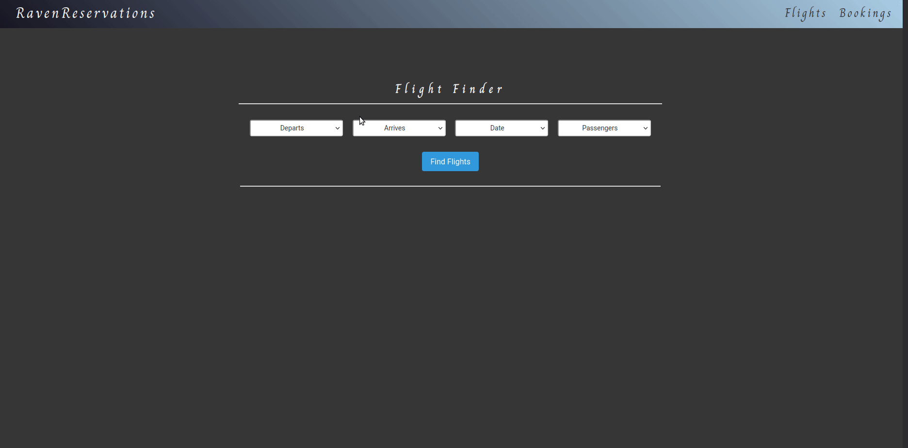

# RavenReservations 

This project is an exercise in building advanced forms completed as part of [The Odin Project](https://www.theodinproject.com/paths/full-stack-ruby-on-rails/courses/ruby-on-rails/lessons/building-advanced-forms). It is a flight-booker app in which hypothetical passengers can search for one way flights to or from airports selected from a dropdown. The database is seeded with random flight data. Flights and passengers are connected through the Bookings table. After viewing available flights, they can then select a flight to book and enter their information. This is done via nested forms, which requires whitelisting the nested attributes. 

Upon booking a flight, users are presented with a confirmation number. On the bookings tab, I implemented a search feature. Users can look up their booking either by confirmation number or email assosciated with the booking.

## Demo

*Booking a flight and then searching for it with confirmation number or passenger email*

***

### Installation

1. Install Locally.
    - Clone this repo.
    - cd into cloned directory `cd odin-flight-booker`
    - `bundle install && yarn install`

2. Seed the database.
    - `rails db:migrate`
    - `rails db:seed`

3. Start a Rails Server.
    - `rails server`
    - Navigate to `localhost:3000` in your browser.

4. Play around with the app.
    - Use the Flight Finder to view available flights
    - Click on "Book Flight" next to a returned flight.
    - Enter your passenger information.
    - Click "Complete Booking".
    - letter_opener opens confirmation email in a browser tab in development OR SendGrid
      sends you an actual email in [production](https://raven-reservations.herokuapp.com/)

### Running the Tests

#### To run all the tests

- `rspec spec/` from the `odin-flight-booker` directory.

#### To run specific spec categories

- `rspec spec/system`
- `rspec spec/models`

### Active Record Associations

- many to many relationships
- `has_many, through:` relationships
- generate db migrations with proper foreign keys
- utilize `accepts_nested_attributes_for`

### Active Record Queries
- connect dropdown select params to queries
- use `includes` method to eager load records where appropriate
- use `joins` to join two tables together when necessary
- implement a `search` feature to search for Bookings by confirmation number or email

### Testing

- RSpec and Capybara
- Model and System specs
- use FactoryBot for fixtures

#### Notable Gems used
- capybara
- bullet
- letter_opener
- guard
- shoulda-matchers
- factory_bot_rails
- faker
- simplecov
